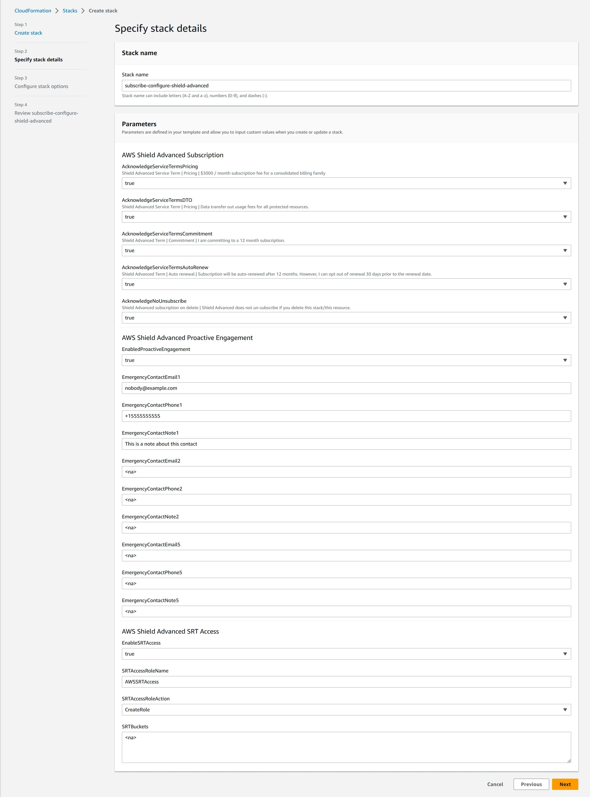

# AWS Shield Advanced Subscription and Configuration with AWS CloudFormation

Two example templates are provided to help you  subscribe and/or configure AWS Shield Advanced using CloudFormation.

The different is shield-configure-subscribe.yaml includes a custom lambda backed resource to subscribe the account to AWS Shield Advanced (if not already).  You can also subscribe an account to AWS Shield Advanced via the [console](https://docs.aws.amazon.com/waf/latest/developerguide/enable-ddos-prem.html), [API](https://boto3.amazonaws.com/v1/documentation/api/latest/reference/services/shield/client/create_subscription.html#), or using [Firewall Manager](https://docs.aws.amazon.com/waf/latest/developerguide/getting-started-fms-shield.html).

Notes:
> The custom lambda backed resource to subscribe to AWS Shield will gracefully continue if an account is already subscribed to AWS Shield Advanced.

> If you delete this template, the custom lambda backed resource does **NOT** unsubscribe you from AWS Shield Advanced.  See [here](https://aws.amazon.com/shield/pricing/) for information about when and how to unsubscribe (Note #3)

## shield-configure-subscribe

This template includes a custom lambda backed resource to subscribe (if not already) the account to AWS Shield Advanced.  If you elect to enable SRT Access and/or Proactive Engagement, the account must have Business or Enterprise support before these can be enabled.

### Parameter Details

#### Shield Advanced Service Terms
Using the console, Shield Advanced prompts to ensure you understand the following about the cost and commitment of the service.  Also, unlike usual CloudFormation resources, when you delete this stack, Shield Advanced is not unsubscribed.  You must set all five of these to true or CloudFormation will not yet you deploy the template
AcknowledgeServiceTermsPricing  
> Shield Advanced Service Term | Pricing | $3000 / month subscription fee for a consolidated billing family  

AcknowledgeServiceTermsDTO
> Shield Advanced Service Term | Pricing | Data transfer out usage fees for all protected resources.

AcknowledgeServiceTermsCommitment
> Shield Advanced Term | Commitment | I am committing to a 12 month subscription.

AcknowledgeServiceTermsAutoRenew
> Shield Advanced Term | Auto renewal | Subscription will be auto-renewed after 12 months. However, I can opt out of renewal 30 days prior to the renewal date.

AcknowledgeNoUnsubscribe
> Shield Advanced does not un-subscribe on delete | Shield Advanced does not un-subscribe if you delete this stack/this resource.

#### Shield Advanced Proactive Engagement
As part of Shield Advanced, you can optionally have SRT (Shield Response Team) proactively contact you when a DDoS event is detected and a configured health check is failing.
EnabledProactiveEngagement
> Enable Proactive Engagement.  Note you must also configure emergency contact(s) and health checks for protected resources for this feature to be effective

EmergencyContactEmail1
> Email address for this emergency contact.

EmergencyContactPhone1
>  Phone number (including country code) for this emergency contact

EmergencyContactNote1
> Any note/comments for SRT about this contact.

#### Shield Advanced Proactive Engagement
As part of Shield Advanced, you can optionally have SRT (Shield Response Team) proactively contact you when a DDoS event is detected and a configured health check is failing.

EnableSRTAccess
> Allow SRT access to update your AWS WAF WebACLs via an IAM role

SRTAccessRoleName
> IAM role name (either to use or create) that will grant SRT Access for SRT

SRTAccessRoleAction
> If CloudFormation should create a role with the above name, or use an exsting role with the above name

SRTBuckets
> [Optional] Authorize and add a bucket policy to SRT access to any S3 buckets with additional logs (not normally used)

## shield-configure-no-subscription

This template assumes you already have subscribe to AWS Shield Advanced outside of this template.  If you elect to enable SRT Access and/or Proactive Engagement, the account must have Business or Enterprise support before these can be enabled.

## StackSets

AWS CloudFormation Stacksets are a native AWS way to deploy a CloudFormation template to many accounts from a single logical entity.  If you choose to use a StackSets to subscribe and configure AWS Shield Advanced, keep the following in mind.

* If using a service managed stack set with auto-deployment enabled, be sure accounts that come into scope of the stackset already have Business or Enterprise Support enabled.
* If using a service managed stack set with auto-deployment enabled and do not use the template that includes creating a Shield subscription fires, ensure you create a Shield subscription before a new account is in scope
* If you use AWS Firewall Manager to subscribe to AWS Shield Advanced for you, you should consider:
    * Use a self managed stack set or service managed stackset with auto-deployment disabled.
    * Target specific OUs with a stackset and create a shield subscription and enable Support before moving an account into scope
